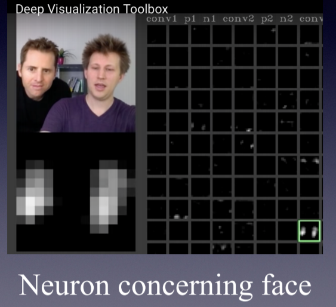
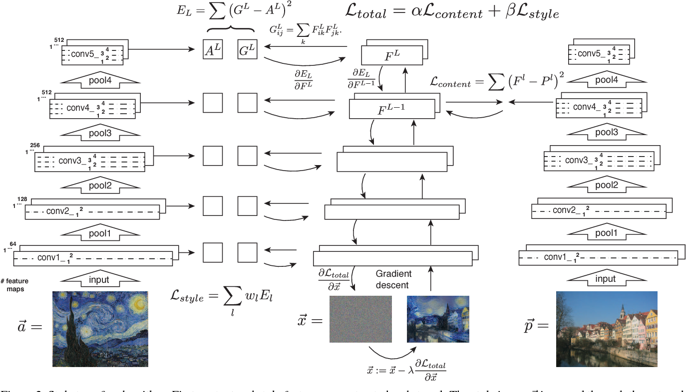

# Lecture 12

In this lecture, we want to dive into the network and find intuition about how these networks do what they do.

# Understanding Network Mechanism by Visualization

### First layer filters

Because the first layer filters are directly inner product with the input image so filter channels are the same as the input image, then we could visualize filters themselves as images. By visualizing them, we could see what feature each filter is looking for. It turns out first layer filters look for fundamental features like edges or colors. It also explains why transfer learning works. In various problems, first layer feature map transfer is similar and could be reused.

96 filters learned in the first convolution layer in AlexNet

### Middle layer filters

But visualizing higher-level filters is tricky. Because the number of channels for each filter relies on the number of filters in the previous layer, they couldn't visualize as RGP or grayscale images. Each channel could be visualized as a grayscale image. The second problem is if you visualize the higher-level filters anyway, they are not interpretable easily. the higher-level layer input comes from previous layers. We don't know exactly what they mean in terms of pixels.

### Last layer vector feature map

Let's look at the layer exactly before the last layer that calculates scores for images. This layer output contains the most high-level features extracted from the image. If we do nearest-neighbor classification on this feature vector to group the images, it works very well despite there aren't many similarities between raw pixels. So we could conclude that the network attends to the semantic of the pictures, not raw pixels.

### Activation map

We realized that understanding the middle layer by visualizing their filters is not much practical but when visualizing the activation map of the middle layer for a specific input, considerable results come out. For example, we could see the specified activation map from the activation volume is sensitive to faces.

[https://youtu.be/AgkfIQ4IGaM](https://youtu.be/AgkfIQ4IGaM)

### Maximally Activation Patches

If you choose a channel for a specific layer from the network and run the network through a bunch of input data, then sort input that maximally activates the activation map, you could get exciting results. For example, each row in the image corresponds to images that maximize specific neurons in a network layer. If we look closely, we could see, for example, that specific neuron looking for a building in one row left to last.

### Occlusion Experiment

Another cool experiment that could be used to understand the network better is the occlusion experiment. In the occlusion experiment, we replace one part of the image by the mean of the training set and track how the changed image influenced the score of classification. We could make a heat map to visualize the important parts. By this technic, we could understand what part of the image has more influence on the network decision. 

### Saliency Maps

In the saliency map method, we calculate the gradient of the true class score to the input image (max over absolute values of the input image). This method would show what part of the image has more effect on the final score.

### Intermediate features via guided back-propagation

Instead of calculating the gradient for the final score, we could calculate it for middle layers to understand what part of the image has more effect on the middle layer output. It turns out that if we change the method that we calculate gradient for the ReLU non-linearities in a specific way leads to better results. Each row in the image shows the specific part that has more effect on the output of that layer for different inputs.

### Gradient Ascent

Previous methods to visualize the specific part of the network produced results for specific input. How could we generalize the method and make it independent from the input? An amazing method is to use gradient ascent. In the gradient ascent, we suppose that weights are fixed, and the input image is a variable, so we try to maximize the final score or middle layer activation by changing the input image. the image could be initialized to zero or a random number.

if we omit the regularizer the final image that is produced is not interpretable and is like a noisy image.

$$I^*=\arg \max_I f(I)+R(I)$$

This image is produced by the gradient ascent method with a small improvement on it.

The color of the images is not much interpretable because we have to run constrained optimization but instead for convenience, we just solved the optimization problem for the input and scale it to output an RGP image.

### Fooling images / Adversarial Examples

# TO DO

### DeepDream

In the DeepDream, instead of initializing input to zero or some random number, we start by real image.

input image

outputs:

amplifying on lower layer:

### Feature Inversion

In the feature inversion, there is a CNN feature vector of the image in a specific layer, and we try to find that matches or is very similar to that feature vector. $\phi(x)$ is the feature vector of image $x$.

$$x^*=\arg\min_{x\in\R^{H\times W \times C}}l(\phi(x), \phi_0)+\lambda R(x)$$

It can be seen first layers preserve the image data, but the last layers just have fundamental information about the input image.

### Neural Texture Synthesis

Given a sample patch of some texture, we want to generate a bigger picture of that picture. To solve these problems with a neural network, we have to redefine the loss for the network. The loss has to depend on the style of the input, not the content. So for this purpose, we define the Gram matrix. To calculate the Gram matrix in each layer we take the outer product of every two depths from activation volume and average over all products.

So these Gram matrices that are produced by specific input summarize the style of the input in themselves. We could run feature inversion on these Gram matrices to rebuild the texture on bigger input. The loss is weighted-sum of Gram matrices of input and style image for several layers. if we calculate the loss in just one layer, it seems for higher-level layers results would be better and overall style is saved. 

### Neural Style Transfer

By combining feature reconstruction and neural texture synthesis, you could rebuild an image with a new style.

For transfer learning first, we calculate Gram matrices for style image in pre-trained network next insert content image and calculate feature vector for write depth in the network. At last, try to make the image that has a Gram matrix that is similar to the style image and feature vector similar to the feature vector of the content image.

