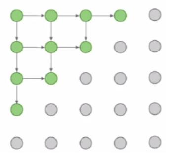

# Lecture 13

# Supervised vs. Unsupervised Learning

The learning is done on input data, and the main difference between supervised and unsupervised learning is input data. We have labels or the correct answers for each input in supervised learning, but there isn't in unsupervised learning.

## 

Data:

Goal:

Examples:

## Supervised

(x, y): pair of data and its label

learn a function that maps $x \to y$

Classification, Regression, Object detection, Semantic segmentation, Image captioning

## Unsupervised

x: just data without label

learn some underlying hidden structure of the data

Clustering, Dimensionality reduction, feature learning, density estimation

# Generative Models

In generative models, we want to produce new samples from input distribution. That means we want to learn distribution $p_{model}(x)$ that is similar to $p_{data}(x)$. in fact this is density estimation problem.

## PixelRNN and PixelCNN

In the PixelRNN and PixelCNN, we try to find the explicit representation of the density model. so we use the chain rule on image pixel as a sequence to define the density model. In the learning phase, we try to maximize the probability of the input data.

$$p(x)=\prod_{i=1}^{n}{p(x_i|x_1,...,x_{i-1})}$$

we have to define the order for pixels. 

### PixelCNN

Dependency on the previous pixel data is modeled by CNN on the context area.

### PixelRNN

Dependency on the previous pixel data is modeled by RNN

The problem of the above models is the too slow operation because of the *sequential* generation.

## Variational AutoEncoders (VAE)

AutoEncoders encode input data by themselves without the need for labels. AutoEncoders try to encode data somehow it could be reconstructed. to train such a network, connect the encoder and decoder. the loss could be the L2 distance between the original input and the reconstructed one.

after finishing the training phase you could throw away the decoder. the remained encoder could do dimensionality reduction on input data and extract semantic information.

It could be used for initializing supervised models.

with probabilistic spin to autoencoders, we could generate new data. if we sample from latent variable $z$ and next sample from $p(x, z^{(i)})$ we could get a probability distribution for $x$ and generate new input $x$ from it. but to train this model we need to optimize this integral:

$$p(x)=\int p(z)p(x|z)dz$$

This integral is intractable in general. to solve the problem add another network $q(z|x)$ that approximates $p(z|x)$. this leads to define a lower bound on p(x) that could be optimized.

at last we could train model like this:

## Generative Adversarial Networks (GAN)

GANs give up explicitly modeling density function. just able to sample from it. It's hard to sample from complex distribution directly, instead sample from simple distribution and learn to transform it to training distribution. This transformation is modeled by a neural network.

### Training GANs

There is two type of NN in training phase of GAN:

- Generator Network: try to produce realistic sample that fool discriminator network.
- Discriminator Network: try to distinguish between real and fake images.

To training these two networks together, you have to alternate between them for optimization.

These two equation have to be optimized.

Discriminator:

$$\max_{\theta_d} \left[\; \mathbb{E}_{x \sim p_{data}}[log \; D_{\theta_d}(x)] + \; \mathbb{E}_{z \sim p(z)}[log \; (1 - D_{\theta_d}(G_{\theta_g}(z)))] \right]$$

Generator:

$$\min_{\theta_g} \left[ \mathbb{E}_{z \sim p(z)}[log \; (1 - D_{\theta_d}(G_{\theta_g}(z)))] \right]
\sim
\max_{\theta_g} \left[ \mathbb{E}_{z \sim p(z)}[log \; (D_{\theta_d}(G_{\theta_g}(z)))] \right]$$