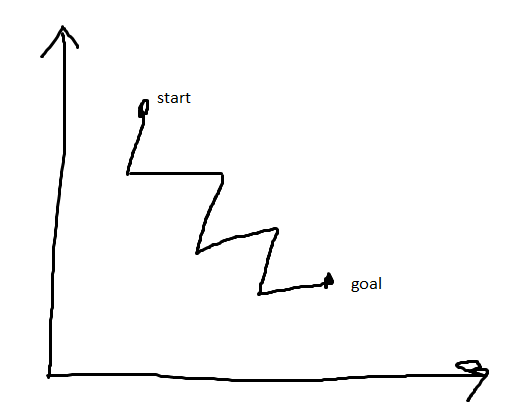

# Lecture 6

# Activation function

If there is no activation function in the neural network, it could be reduced to one layer network. So non-linearity is essential in NN.

$$\forall A_i \exist B \mid A_n \times A_{n-1} \times ... \times A_1 \times X = B \times X$$

## Sigmoid

$$\sigma(x) = \frac{1}{1+e^{-x}} \\ Range \in (0, 1)$$

[https://www.desmos.com/calculator/bi07ig0wes](https://www.desmos.com/calculator/bi07ig0wes)

✖️ The gradient for very high and very negative values is zero. So saturated neurons kill the gradient in backpropagation. I think this problem leads to a lower learning rate.

✖️ Sigmoid outputs are not zero-centered. So local gradients on W are always positive. This limits gradient direction and a low learning rate.

✖️ $e^x$ is computationally expensive.

## tanh

$$\tanh(x) = \frac{e^x-e^{-x}}{e^x+e^{-x}} = \frac{e^{2x}-1}{e^{2x}+1} \\ Range \in (-1, 1)$$

[https://www.desmos.com/calculator/zqoehg93q6](https://www.desmos.com/calculator/zqoehg93q6)

$tanh(x)$ is scaled version of $σ(x)$. 

$$\tanh(x) = 2\sigma(2x)-1$$

✔️ zero centered

✖️ saturated neurons kill the gradient

## ReLU (Rectified Linear Unit)

$$f(x) = \max(0, x) \\ Range \in [0, +\infty)$$

[https://www.desmos.com/calculator/mchx8mspxu](https://www.desmos.com/calculator/mchx8mspxu)

✔️ Empirical studies show that training NN with ReLU activation function is much faster. One reason for that could be, it does not saturate for large positive data because the gradient is one instead of zero.

✔️ It's computationally cheap compared $tanh(x)$ and $σ(x)$.

✖️ Because the local gradient is zero or positive, the learning rate and first initialization of neuron weights become super important. Most of the time, most neurons will die in the network and can't improve themselves.

## Leaky ReLU

$$f(x) = \max(0.01x, x) = \begin{cases} x & x \geq 0 \\ 0.01x  & x <0 \end{cases} \\ Range \in (-\infty, +\infty)$$

[https://www.desmos.com/calculator/9hwtyreymi](https://www.desmos.com/calculator/9hwtyreymi)

Tried to solve the dying problem of the ReLU activation function.

## Maxout

generalization on ReLU.

$$max(w_1^Tx+b_1, w_2^Tx + b_2)$$

✔️ More flexibility.

✖️ Double the number of parameters.

# Universal Approximator

It turns out that an NN with just one hidden layer and sufficient neurons could converge to any continuous function. So we could explain any concept with at most two linear hierarchical functions. So if we define the hardness of the problem with the depth of NN, there are just two hardness levels for problems.

# Structure of NN as hyperparameter

Setting the number of layers and their size are important hyperparameters for NN. If the structure is too big, then overfitting may occur. Overfitting means the model fits even on noisy data so that it couldn't be generalized well on test data. But more neurons can represent more complex functions. To solve overfitting, we use other methods like regularization. The main disadvantage for large NN is the high demand for computational power. 

# Data preprocessing

Many data preprocessing techniques are used in machine learning and data science, but we restrict ourselves to the most commonly used ones in computer vision.

## Mean subtraction (zero centering)

We prefer data to be equally distributed around zero, not to limit local gradient signs (all positive or negative). In computer vision, if all images are the same shape, we could get mean for each pixel. If images are not the same shape, we could get mean from color channels.

## Normalization

if input data has a different domain but equally contributes to the final score, it is preferred to normalize inputs. The widely used method is to divide by standard deviation. But for image data, pixels have the same range, so normalization is not commonly used for image inputs.

❗Any statistical parameters for preprocessing must be computed just on training data and then applied to validation and test data.

# Weight initialization

Before starting training the NN, we have to begin with some weights for neurons. Empirical evidence shows that initialized values for weights could be very important.

The first guess may be zero initialize all weights. But if doing so, all the neurons learn the same feature. If we use ReLU non-linearity in the network with at least one hidden layer, all weights remain zero during the training phase.

The next method is to use small random numbers sampled from the normal distribution. But the problem of this method is the variance of output increase linearly with the increasing number of inputs.

To solve the above problem, we could divide the random numbers by $\sqrt{n}$

# Batch normalization

To reduce the *covariance shift effect* for each layer's input, we add a normalization layer for each layer. This allows us to adopt a higher learning rate.

$$\hat{x}^{(k)}=\frac{{x}^{(k)}-E[{x}^{(k)}]}{\sqrt{Var[{x}^{(k)}]}}$$